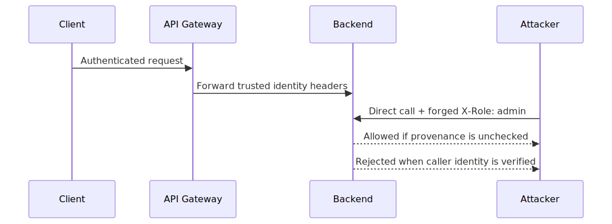
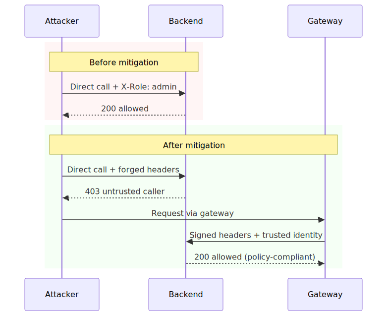

# API Gateway Trust Boundary Failures

## Executive Summary

API gateways often create a dangerous illusion: teams centralize authentication and coarse authorization at the edge, then implicitly trust forwarded identity headers deep inside service code. That model works until one backend is unexpectedly reachable, one internal caller is over-trusted, or one legacy path bypasses provenance checks.

This is usually not a single bug. It is an architectural trust-boundary mismatch between edge controls and service-hop enforcement.

## System Context

Typical system architecture:

- API gateway performs external auth and coarse policy checks.
- Gateway forwards identity context (`X-User-Id`, `X-Role`, `X-Tenant-Id`).
- Backend services consume these headers for downstream authorization.
- Internal network and mesh are assumed to be trusted enough to preserve header integrity.

Hidden assumption:

- "Only trusted gateway paths can reach backend services."

## Baseline Architecture

See `architecture.svg` (rendered) and `diagrams/architecture.mmd` (source).

## Trust Boundaries

See `trust-boundary.svg` (rendered) and `diagrams/trust-boundary.mmd` (source).

## Threat Model

Trust assumptions:

- Header identity is only produced by trusted infrastructure.
- Backend ingress is constrained to expected upstream callers.
- Gateway and backend policy intent stay synchronized.

Attacker capability assumptions:

- Attacker can discover or reach an internal/backend route.
- Attacker can craft custom headers and replay authenticated-looking requests.
- Attacker may pivot through an internal service (SSRF or compromised workload).

Failure conditions that matter:

- Backend reachable outside gateway control path.
- Caller identity not cryptographically or transport-bound.
- Legacy route bypasses full policy evaluation.

## Normal Flow

1. Client authenticates at gateway.
2. Gateway validates token and policy.
3. Gateway forwards identity context headers.
4. Backend authorizes request using trusted caller + trusted context.

## Failure Modes

1. Direct backend reachability.

- Service exposed via ingress, load balancer, or temporary debug route.
- Attacker calls backend directly and injects privileged headers.

2. Header trust without authenticity.

- Backend treats plaintext headers as authoritative identity.
- No mTLS caller verification or signed-context validation.

3. Policy drift across hops.

- Gateway policy updated, backend enforcement remains stale.
- Sensitive route remains permissive despite edge hardening.

4. Internal pivot abuse.

- Compromised internal workload calls backend with forged context.
- SSRF path bypasses external controls while preserving trusted network posture.

## Attack and Abuse Flow

See `attack-flow.svg` (rendered) and `diagrams/attack-flow.mmd` (source).

See `sequence.svg` (rendered) and `diagrams/sequence.mmd` (source).

## Before vs After Mitigation (Sequence Snapshot)

See `before-after-sequence.svg` (rendered) and `diagrams/before-after-sequence.mmd` (source).

## Impact

- Confidentiality: unauthorized access to user/tenant data.
- Integrity: privileged actions via forged or replayed identity context.
- Availability: bypassed routes can evade edge throttling and overload internals.
- Governance: false confidence that "gateway secured everything".

## Detection Opportunities

High-signal telemetry to instrument:

- Requests with identity headers from non-gateway principals.
- Backend allow decisions where caller identity is missing/unknown.
- Divergence between gateway deny decisions and backend allow decisions.
- Unexpected backend ingress source CIDRs / service accounts.
- mTLS handshake failures on routes expected to be strict.

## Mitigation Architecture

See `mitigation-architecture.svg` (rendered) and `diagrams/mitigation-architecture.mmd` (source).

## Mitigation Strategy

See [mitigations.md](./mitigations.md).

Practical strategy layers:

- Remove direct backend reachability and enforce private ingress.
- Bind caller identity using mTLS/workload identity.
- Validate signed context headers (freshness + integrity).
- Re-check sensitive authorization decisions at backend boundary.

## Mitigation Tradeoffs (Engineering Reality)

| Control | Security Benefit | Latency / Cost | Typical Failure Mode |
| --- | --- | --- | --- |
| Private-only backend ingress | High | Low-Medium ops overhead | Drift from emergency exposure changes |
| mTLS workload identity | High | Cert lifecycle complexity | Misissued identity or policy misbinding |
| Signed context headers | Medium-High | Crypto verification cost | Signature key rotation gaps |
| Backend authz re-check | Medium-High | Extra policy evaluation | Policy duplication and logic drift |

## When Not to Use a Pattern

- Header-signing alone is not sufficient when backend reachability is unconstrained.
- Mesh identity alone is not sufficient if backend authorization logic trusts mutable user-role headers.
- Full per-request centralized policy calls may be excessive for low-risk internal read paths with strict caller identity.

Pattern selection should follow route risk tiering, not blanket adoption.

## Why Existing Systems Fail

Most teams arrive here through practical delivery tradeoffs:

- Re-implementing complete auth logic in every backend feels expensive.
- Temporary exposure for debugging/migration becomes semi-permanent.
- Platform and service teams deploy controls at different speeds.
- Convenience of header-based context outlives threat-model assumptions.

Over time, "gateway-enforced" becomes a belief instead of a continuously verified system property.

## Real Incident Correlation

Common incident patterns that map to this architecture:

- Internal API exposure beyond intended trust zone.
- Header spoofing and confused-deputy behavior in service-to-service flows.
- SSRF pivots bypassing perimeter auth into internal privileged routes.

The recurring lesson is operational, not theoretical: perimeter controls help, but hop-by-hop caller authenticity is what contains blast radius.

## Implementation References

Concrete implementation examples:

- [Kubernetes NetworkPolicy](./implementations/kubernetes/networkpolicy.yaml)
- [Istio AuthorizationPolicy](./implementations/istio/authorizationpolicy.yaml)
- [Envoy ext_authz snippet](./implementations/envoy/ext_authz_snippet.yaml)
- [OPA policy example](./implementations/opa/policy.rego)

## Evidence

Signals to collect for validation:

- Metrics: backend bypass attempt rate, caller-identity reject rate, and policy divergence rate.
- Logs: principal identity, route policy result, signed-header verification result.
- Tests: forged-header replay, direct-backend access probes, and SSRF pivot simulation.

## Practical Demo

Companion demo:

- [api-gateway-boundary-lab](../demo/api-gateway-boundary-lab/README.md)
- [Run script](../demo/api-gateway-boundary-lab/run-demo.sh)

## Known Limitations

- Demo intentionally simplifies full service mesh and certificate lifecycle behavior.
- It does not model every legacy proxy/auth chain found in large enterprises.
- Mitigation correctness still depends on key/cert rotation and policy ownership hygiene.

## References

See [references.md](./references.md).
