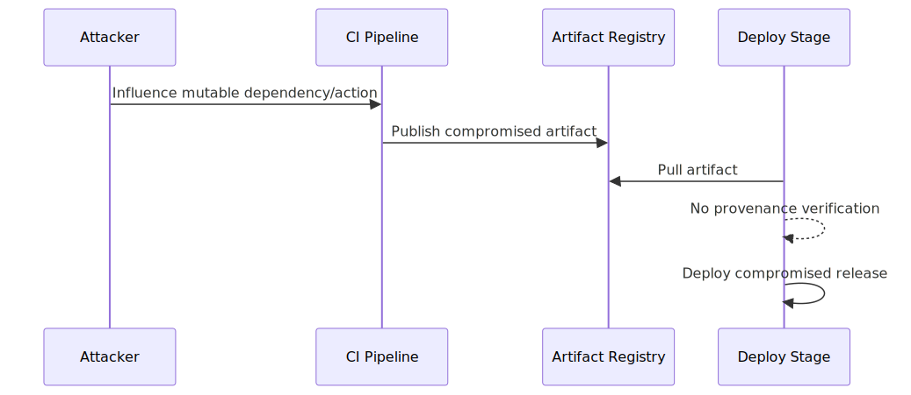

# CI/CD Supply Chain Risk in Modern Delivery Pipelines

## Executive Summary

CI/CD pipelines are high-trust control planes. Compromise of build dependencies, action plugins, runner environments, or artifact signing paths can inject malicious code into release artifacts without direct source-repo compromise.

This is a trust-transitivity architecture problem across source, build, artifact, and deploy stages.

## System Context

Typical pipeline:
- source repository and pull request workflow
- CI runner executing workflow definitions
- third-party actions/plugins and package dependencies
- artifact registry and deployment system

Security invariant:
- only reviewed and trusted code should reach production artifacts

## Baseline Architecture

See `architecture.svg` (rendered) and `diagrams/architecture.mmd` (source).

## Normal Flow

1. Developer opens PR.
2. CI runs tests/build with dependencies and actions.
3. Artifact is built, signed, and pushed.
4. CD deploys approved artifact to environments.

## Failure Modes

1. Unpinned third-party actions
- workflow references mutable tags (`@v1`) instead of commit SHA
- upstream compromise changes runtime behavior silently

2. Dependency confusion/poisoning
- malicious package resolved due to namespace/version ambiguity

3. Secrets exposure in CI context
- overly broad tokens available to untrusted PR contexts

4. Artifact integrity gaps
- deploy stage does not verify provenance/signature

## Attack/Abuse Flow

See `attack-flow.svg` (rendered) and `diagrams/attack-flow.mmd` (source).

## Impact

- Confidentiality: exfiltration of secrets/tokens from runner.
- Integrity: malicious artifact promotion to production.
- Availability: pipeline disruption and rollback instability.
- Trust: release credibility and customer confidence damage.

## Detection Opportunities

- workflow changes that broaden permissions unexpectedly
- action version drift without corresponding review
- unsigned/unverifiable artifacts reaching deployment
- anomalous outbound network patterns during build

## Mitigation Strategy

See [mitigations.md](./mitigations.md).

## Practical Demo

Companion lab:
- [cicd-supply-chain-lab](../demo/cicd-supply-chain-lab/README.md)

## References

See [references.md](./references.md).
