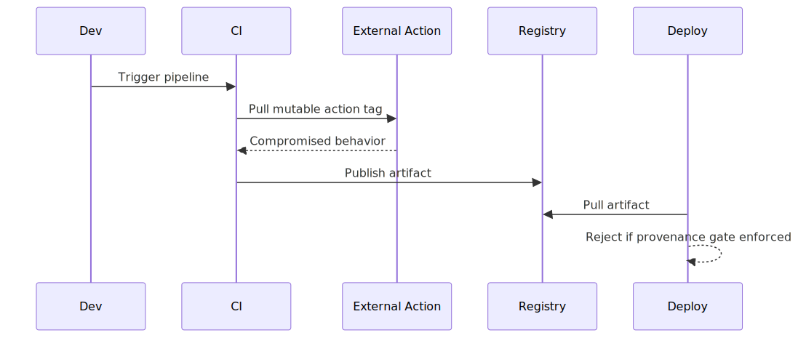

# CI/CD Supply Chain Risk in Modern Delivery Pipelines

## Executive Summary

CI/CD pipelines are high-trust control planes. Compromise of build dependencies, action plugins, runner environments, or artifact signing paths can inject malicious code into release artifacts without direct source-repo compromise.

This is a trust-transitivity architecture problem across source, build, artifact, and deploy stages.

## System Context

Typical pipeline:
- source repository and pull request workflow
- CI runner executing workflow definitions
- third-party actions/plugins and package dependencies
- artifact registry and deployment system

Security invariant:
- only reviewed and trusted code should reach production artifacts

## Baseline Architecture

See `architecture.svg` (rendered) and `diagrams/architecture.mmd` (source).

## Normal Flow

1. Developer opens PR.
2. CI runs tests/build with dependencies and actions.
3. Artifact is built, signed, and pushed.
4. CD deploys approved artifact to environments.

## Failure Modes

1. Unpinned third-party actions
- workflow references mutable tags (`@v1`) instead of commit SHA
- upstream compromise changes runtime behavior silently

2. Dependency confusion/poisoning
- malicious package resolved due to namespace/version ambiguity

3. Secrets exposure in CI context
- overly broad tokens available to untrusted PR contexts

4. Artifact integrity gaps
- deploy stage does not verify provenance/signature

## Attack/Abuse Flow

See `attack-flow.svg` (rendered) and `diagrams/attack-flow.mmd` (source).

See `sequence.svg` (rendered) and `diagrams/sequence.mmd` (source).

## Impact

- Confidentiality: exfiltration of secrets/tokens from runner.
- Integrity: malicious artifact promotion to production.
- Availability: pipeline disruption and rollback instability.
- Trust: release credibility and customer confidence damage.

## Detection Opportunities

- workflow changes that broaden permissions unexpectedly
- action version drift without corresponding review
- unsigned/unverifiable artifacts reaching deployment
- anomalous outbound network patterns during build

## Mitigation Strategy

See [mitigations.md](./mitigations.md).

## Why Existing Systems Fail

Pipeline risk grows from delivery pressure and trust transitivity:
- Mutable CI action references are faster to maintain than pinned SHAs.
- Broad tokens simplify automation but increase blast radius.
- Artifact verification is deferred to speed release cadence.
- Third-party integrations accumulate without uniform risk gates.

Pipelines become high-trust control planes with low-friction compromise paths.

## Real Incident Correlation

This case aligns with major supply-chain events and patterns:
- CircleCI incident (session/token exposure impact across customers).
- SolarWinds build-chain compromise pattern.
- Codecov script tampering and secret-exposure pattern.

The practical takeaway is to treat CI/CD as production-critical identity and integrity infrastructure.

## Evidence

Signals to collect for validation:

- Metrics: `time-to-final-reject`, `policy-deny-rate`, and cross-replica decision divergence.
- Logs: identity context, enforcement path, and reason code for allow/deny decisions.
- Tests: replay, propagation-delay, and failover behavior under sustained load.

## Practical Demo

Companion demo:

- [cicd-supply-chain-lab](../demo/cicd-supply-chain-lab/README.md)
- [Run script](../demo/cicd-supply-chain-lab/run-demo.sh)

## Known Limitations

- Demonstrations simplify production controls and omit organization-specific policy layers.
- Timing windows and failure behavior vary by deployment topology and traffic patterns.
- Mitigations reduce risk but do not eliminate compromised-token or insider-abuse classes entirely.

## References

See [references.md](./references.md).
