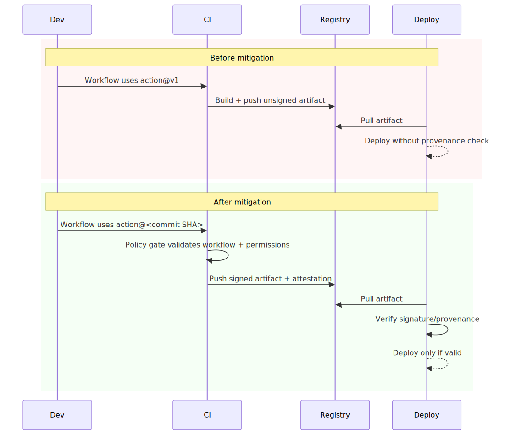

# CI/CD Supply Chain Risk in Modern Delivery Pipelines

## Executive Summary

CI/CD systems are trust multipliers. If the pipeline is compromised, release artifacts inherit that compromise quickly and at scale. Many teams intentionally prioritize delivery speed, which often leaves broad privileges, mutable dependencies, and weak provenance gates in critical release paths.

The architectural risk is trust transitivity from source to build to artifact to deployment.

## System Context

Typical pipeline architecture:

- Source repository and pull-request workflow.
- CI runners executing workflow definitions.
- Third-party actions and package dependencies.
- Artifact registry and deployment pipeline.

Security invariant:

- Only reviewed, trusted, and verifiable artifacts should reach production.

## Baseline Architecture

See `architecture.svg` (rendered) and `diagrams/architecture.mmd` (source).

## Trust Boundaries

See `trust-boundary.svg` (rendered) and `diagrams/trust-boundary.mmd` (source).

## Threat Model

Trust assumptions:

- Workflow definitions are reviewed and policy-compliant.
- Build environment executes only intended code paths.
- Artifact promotion includes integrity and provenance checks.

Attacker capability assumptions:

- Attacker can influence mutable dependencies/actions.
- Attacker may obtain CI token or runner-level execution foothold.
- Attacker can attempt artifact substitution or unsigned artifact promotion.

Failure conditions that matter:

- Mutable build inputs accepted without policy guard.
- Broad credentials available in untrusted execution contexts.
- Deploy gates skip signature/provenance verification.

## Normal Flow

1. Developer opens PR or push triggers pipeline.
2. CI resolves actions and dependencies, then runs build/test.
3. Artifact is built, signed, and pushed.
4. Deploy stage verifies provenance and promotes artifact.

## Failure Modes

1. Unpinned third-party actions.

- Workflow references mutable tags (`@v1`) instead of commit SHA.
- Upstream compromise can silently change build behavior.

2. Dependency confusion and poisoning.

- Malicious package is resolved due to namespace/version ambiguity.
- Build succeeds with unintended code in artifact.

3. Secrets exposure in CI context.

- Broad tokens available to untrusted PR or insufficiently isolated runner context.
- Credentials exfiltrated and reused outside intended scope.

4. Artifact integrity gaps.

- Deploy stage does not enforce signature/provenance checks.
- Unverified artifact reaches production path.

## Attack and Abuse Flow

See `attack-flow.svg` (rendered) and `diagrams/attack-flow.mmd` (source).

See `sequence.svg` (rendered) and `diagrams/sequence.mmd` (source).

## Before vs After Mitigation (Sequence Snapshot)

See `before-after-sequence.svg` (rendered) and `diagrams/before-after-sequence.mmd` (source).

## Impact

- Confidentiality: CI secrets and tokens exposed from build context.
- Integrity: malicious or tampered artifacts promoted to runtime.
- Availability: build/deploy disruption and rollback instability.
- Trust: release credibility and customer confidence degradation.

## Detection Opportunities

High-signal telemetry to instrument:

- Workflow changes that expand permissions or alter deploy jobs.
- Mutable action refs in privileged workflows (`@v*` instead of pinned SHA).
- Build artifacts without signature/attestation metadata.
- Deploy attempts with provenance mismatch.
- Unusual runner egress to non-approved hosts.

## Mitigation Architecture

See `mitigation-architecture.svg` (rendered) and `diagrams/mitigation-architecture.mmd` (source).

## Mitigation Strategy

See [mitigations.md](./mitigations.md).

Practical strategy layers:

- Enforce immutable action/dependency references.
- Scope CI credentials with least privilege.
- Use ephemeral hardened runner controls.
- Require artifact signing and deploy-time provenance verification.

## Mitigation Tradeoffs (Engineering Reality)

| Control | Security Benefit | Latency / Cost | Typical Failure Mode |
| --- | --- | --- | --- |
| Immutable action pinning | High | Low maintenance cost | Pin drift without update process |
| Least-privilege workflow tokens | High | Medium policy overhead | Privilege creep over time |
| Ephemeral runner hardening | Medium-High | Infra + startup overhead | Gaps in image hygiene or egress policy |
| Provenance verification gate | High | Medium deploy overhead | Bypass via emergency/manual path |

## When Not to Use a Pattern

- Do not apply blanket restrictive permissions without migration path for legacy automation; it can cause unsafe workaround behavior.
- Do not depend on signing alone if deploy gates do not verify attestations.
- Do not centralize all policy checks in one gate without fallback design for pipeline availability incidents.

## Why Existing Systems Fail

Teams usually optimize throughput before integrity controls are mature:

- Mutable references are easier to maintain than pinned SHAs.
- Broad credentials reduce friction when automations are evolving quickly.
- Provenance controls are deferred to reduce release lead time.
- Third-party integrations accumulate faster than governance hardening.

The result is a high-trust control plane with uneven integrity boundaries.

## Real Incident Correlation

This architecture pattern aligns with widely discussed incident classes:

- CircleCI: credential/session exposure impact patterns.
- SolarWinds: build-chain trust compromise at scale.
- Codecov: script-integrity and secret-exposure pathway.

Different mechanics, same lesson: release integrity must be continuously verified, not inferred from build success.

## Implementation References

Concrete implementation examples:

- [GitHub Actions hardened workflow](./implementations/github-actions/hardened-workflow.yml)
- [Provenance gate pseudocode](./implementations/provenance/verify-pseudocode.md)
- [Workflow policy rules](./implementations/policy-gate/rules.md)
- [Runner hardening controls](./implementations/runner-hardening/controls.md)

## Evidence

Signals to collect for validation:

- Metrics: unsigned artifact reject rate, workflow-policy violation rate, provenance mismatch rate.
- Logs: workflow permission set, action refs, artifact signature status, deploy gate decisions.
- Tests: mutable-action simulation, unsigned artifact promotion attempt, token-scope abuse scenario.

## Practical Demo

Companion demo:

- [cicd-supply-chain-lab](../demo/cicd-supply-chain-lab/README.md)
- [Run script](../demo/cicd-supply-chain-lab/run-demo.sh)

## Known Limitations

- Demo models policy behavior and not a full enterprise CI platform implementation.
- It does not emulate every runner-image, secrets-manager, or deploy-controller variant.
- Real resilience requires aligned controls across review, build, signing, and release operations.

## References

See [references.md](./references.md).
