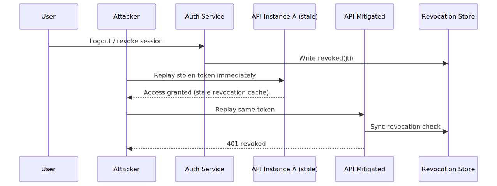

# JWT Revocation Failure in Distributed Systems

## Executive Summary

JWT revocation frequently fails in distributed architectures because revocation is treated as a control-plane event while token validation is executed as a low-latency data-plane decision. When services validate tokens offline (signature + `exp`) and rely on eventually consistent revocation caches, revoked tokens can remain usable across instances for seconds or minutes.

This gap is not a cryptographic failure. It is an architecture consistency failure under scale, propagation delay, cache staleness, and fail-open behavior.

## System Context

Typical system shape:
- identity provider issues short-lived access tokens and longer-lived refresh tokens
- API gateway forwards bearer tokens to multiple backend services
- services validate JWTs locally using issuer keys
- revocation state is stored in Redis or similar KV store and optionally copied into per-instance memory caches

Trust model:
- signed JWT is trusted as authentic
- revocation store is trusted as the source of session invalidation truth
- each service instance is trusted to enforce revocation uniformly

The third assumption is where systems often fail.

## Baseline Architecture

See `architecture.svg` (rendered) and `diagrams/architecture.mmd` (source).

Core components:
- Auth Service (issue/revoke)
- Redis revocation store (`jti`, `sid`, or token-hash denylist)
- API Service replicas (stateless auth checks + optional local cache)
- clients with bearer tokens

## Normal Flow

1. Client authenticates and receives JWT containing `sub`, `jti`, `iat`, `exp`, `aud`.
2. Client calls service with bearer token.
3. Service validates signature and claims.
4. Service optionally checks revocation source or local revocation cache.
5. Access granted.

## Failure Mode

### Broken Assumption

"If revocation is written to Redis, all services will enforce revocation immediately."

### Trigger Conditions

- per-instance revocation caches refresh every N seconds
- network jitter or retries delay revocation propagation
- services run with fail-open behavior when revocation backend is slow/unavailable
- mixed fleet behavior during rolling deploys (some instances check denylist, some do not)

### Why It Appears at Scale

At high QPS, teams optimize for low-latency JWT verification and minimize synchronous dependencies. That creates a split-brain auth model:
- token authenticity is checked synchronously
- token liveness (revocation status) is checked asynchronously or inconsistently

Attackers exploit that timing window.

## Attack/Abuse Flow

See `attack-flow.svg` (rendered) and `diagrams/attack-flow.mmd` (source).

Representative replay path:
1. Attacker obtains a valid token (stolen device/session leak/log exposure).
2. User logs out or security team revokes session.
3. Revocation is written centrally.
4. Attacker rapidly replays token against an instance with stale cache or fail-open path.
5. Requests succeed until revocation is observed or token expires.

## Impact

- Confidentiality: continued data access after logout or compromise handling.
- Integrity: unauthorized state changes using nominally revoked identity.
- Availability: revocation storms can overload centralized denylist checks if not designed for scale.
- Blast radius: cross-service impact when shared token is accepted by multiple downstream services.

## Detection Opportunities

- successful requests using tokens whose `jti` appears in revoke events
- spikes in post-logout API activity per session or device fingerprint
- instance-level divergence: one replica rejects while another accepts same token
- revocation latency SLO breach (time from revoke event to last accepted request)

## Mitigation Strategy

See [mitigations.md](./mitigations.md).

High-level direction:
- reduce revocation window with short-lived access tokens
- standardize revocation enforcement via central introspection for sensitive routes
- use push-based invalidation events and strict fail-closed policy for high-risk operations

## Common Anti-Patterns

- Long-lived access tokens with weak session invalidation controls.
- Best-effort cache refresh without revocation convergence SLOs.
- Mixed fail-open and fail-closed behavior across services.
- Revocation checks enforced only at gateway, not downstream high-risk services.

## Mitigation Decision Matrix

| Pattern | Security Gain | Latency Cost | Operational Complexity | Best Fit |
| --- | --- | --- | --- | --- |
| Short access-token TTL | Medium | Low | Low | Broad baseline hardening |
| Central introspection on sensitive routes | High | Medium | Medium | High-value operations |
| Event-driven revocation fan-out | High | Low-Medium | High | Large distributed fleets |
| Session version checks | Medium-High | Medium | Medium | Stateful identity platforms |

## Validation Scenarios

1. Revoke token during sustained request replay and measure time-to-last-accept.
2. Inject revocation-store latency and verify deterministic policy behavior.
3. Test rolling deploy with mixed versions to ensure no bypass paths.
4. Replay revoked tokens against every public and internal enforcement hop.

## Practical Demo

Runnable companion lab:
- [jwt-revocation-lab](../demo/jwt-revocation-lab/README.md)

## References

See [references.md](./references.md).
