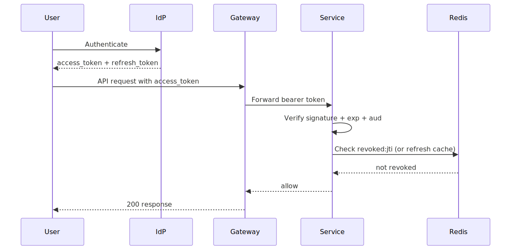
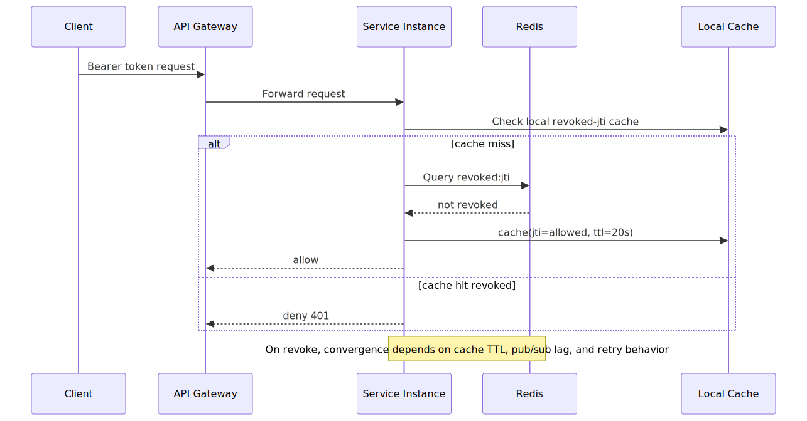
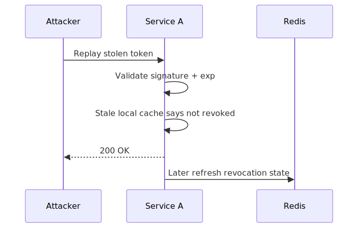
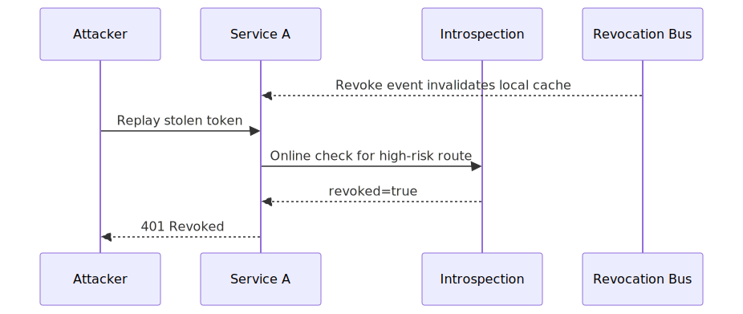

# JWT Revocation Failure in Distributed Systems

## Executive Summary

JWT revocation frequently fails in distributed architectures because revocation is a control-plane action while token validation is a latency-sensitive data-plane decision. When services validate tokens offline (signature + `exp`) and use eventually consistent revocation state, revoked tokens can remain usable for seconds or minutes.

This is rarely a crypto failure. It is typically a systems-consistency failure under replication lag, cache staleness, fail-open behavior, and uneven rollout across replicas.

## System Context

Typical system architecture:

- Identity provider issues short-lived access tokens and longer-lived refresh tokens.
- API gateway forwards bearer tokens to multiple backend services.
- Services validate JWTs locally using issuer keys.
- Revocation state is stored in Redis or equivalent and may be mirrored in local in-memory caches.

Trust model:

- Signed JWT is trusted as authentic.
- Revocation state is trusted as the source of session invalidation truth.
- Every service instance is assumed to enforce revocation consistently.

The third assumption is where production systems often fail.

## Baseline Architecture

See `architecture.svg` (rendered) and `diagrams/architecture.mmd` (source).

## Trust Boundaries

See `trust-boundary.svg` (rendered) and `diagrams/trust-boundary.mmd` (source).

## Distributed Topology

See `distributed-topology.svg` (rendered) and `diagrams/distributed-topology.mmd` (source).

## Normal Auth Flow

See `auth-flow.svg` (rendered) and `diagrams/auth-flow.mmd` (source).

## Threat Model

Trust assumptions:

- Token signature verification is correct and issuer keys are valid.
- Revocation writes are durable in the control plane.
- Service replicas should converge to consistent revocation decisions.

Attacker capability assumptions:

- Attacker can obtain at least one valid bearer token.
- Attacker can generate high-rate replay requests across endpoints/replicas.
- Attacker cannot forge signatures, but can exploit revocation timing windows.

Failure conditions that matter:

- Revocation propagation lag exceeds acceptable risk window.
- Replica enforcement diverges under cache or dependency degradation.
- Fail-open behavior activates on high-risk routes.

## Failure Modes

### Broken Assumption

"If revocation is written centrally, all services will enforce revocation immediately."

### Trigger Conditions

- Per-instance revocation caches refresh on interval (for example every 10-30 seconds).
- Network jitter or retries delay revocation propagation.
- Services run fail-open when revocation backend is slow or unavailable.
- Rolling deploys create mixed behavior across old/new auth middleware paths.

### Why It Appears at Scale

At high QPS, teams optimize local verification to protect p95/p99 latency and reduce dependency blast radius. That creates split-brain auth:

- Authenticity is checked synchronously (signature and claims).
- Liveness is checked asynchronously or inconsistently (revocation status).

Attackers exploit the consistency window between those two checks.

## Attack and Replay Flow

See `attack-flow.svg` (rendered) and `diagrams/attack-flow.mmd` (source).

See `sequence.svg` (rendered) and `diagrams/sequence.mmd` (source).

Representative replay path:

1. Attacker obtains a valid bearer token (device compromise, HAR leak, log exposure).
2. User logs out or security team revokes the session.
3. Revocation is written centrally.
4. Attacker rapidly replays the token against a stale instance.
5. Requests continue until revocation converges or token expires.

## Redis Consistency and Propagation Reality

Revocation behavior depends on Redis design and integration style, not only Redis availability.

Common patterns:

- Single Redis lookup on every request: strongest consistency, higher latency and dependency pressure.
- Local cache + periodic refresh: lower latency, explicit stale window.
- Redis pub/sub invalidation + local cache: faster convergence, but sensitive to consumer lag and reconnect behavior.
- Multi-region Redis replication: revocation windows widen during inter-region lag or failover.

Operational pain points:

- Cache TTL selected for latency can silently become security exposure budget.
- Backpressure during incidents increases propagation delay exactly when revocation urgency is highest.
- A temporary fail-open toggle can become a long-lived risk if not bounded by policy and alerting.

## Token Replay Timeline Example

| Time | Event | Service A (stale) | Service B (fresh) |
| --- | --- | --- | --- |
| `t0` | Token issued | Accept | Accept |
| `t1` | Session revoked at IdP | Accept (cache not refreshed) | Reject (revocation applied) |
| `t2` | Attacker replay burst | Accept some requests | Reject all requests |
| `t3` | Cache/event convergence | Reject | Reject |

The measurable risk is `t1 -> t3`: time-to-final-reject after revocation.

## Impact

- Confidentiality: continued data access after logout or compromise handling.
- Integrity: unauthorized state changes under nominally revoked identity.
- Availability: revocation storms can overload centralized checks if architecture is not load-shaped.
- Blast radius: shared token acceptance across multiple services expands exposure surface.

## Detection Opportunities

- Successful requests where `jti` appears in revoke events.
- Spikes in post-logout activity by session/device fingerprint.
- Instance divergence where one replica accepts and another rejects the same token.
- Revocation SLO breach: elapsed time from revoke event to final reject.

## Before vs After Mitigation (Sequence Snapshot)

Before mitigation:

After mitigation:

## Mitigation Architecture

See `mitigation-architecture.svg` (rendered) and `diagrams/mitigation-architecture.mmd` (source).

## Mitigation Strategy

See [mitigations.md](./mitigations.md).

Practical strategy layers:

- Short access token TTL to bound replay window.
- Centralized online liveness checks for high-risk operations.
- Event-driven invalidation for fast multi-instance convergence.
- Explicit policy on fail-open vs fail-closed by route risk class.

## Mitigation Tradeoffs (Engineering Reality)

| Control | Security Benefit | Latency / Cost | Typical Failure Mode |
| --- | --- | --- | --- |
| Very short access-token TTL | Reduces replay window | More refresh traffic | Refresh flow overload or UX friction |
| Per-request introspection | Strong liveness guarantee | Added hop and dependency | Auth backend saturation during spikes |
| Pub/sub invalidation | Fast convergence | Messaging complexity | Consumer lag, dropped subscriptions |
| Local cache with TTL | Low request latency | Bounded stale window | Accept-after-revoke gap |
| Fail-closed for critical routes | Strong containment | Potential availability impact | False positives during backend incident |

## Why Existing Systems Fail

Teams usually do not ignore revocation risk. They make rational local choices under pressure:

- Latency budgets push verification to local fast paths.
- Availability goals discourage hard dependencies on control-plane systems.
- Ownership boundaries split IdP, platform, and application enforcement behavior.
- Incident pressure favors fast mitigations over architectural convergence guarantees.

The result is a predictable consistency gap between control-plane intent and data-plane enforcement.

## Real-World Incident Correlation

This pattern aligns with recurring incident classes seen across the industry:

- Session token theft followed by replay before global invalidation converges.
- OAuth/OIDC implementation mistakes where token lifecycle controls are uneven across services.
- Support/log/HAR exposure events where valid tokens are reused within short windows.

Public examples often discussed in security postmortems include:

- Okta support-system breach discussions that highlighted session-token theft risk and replay urgency.
- OAuth implementation-failure reports where token validation intent drift caused unintended acceptance.
- CI/CD and identity-adjacent incidents (for example CircleCI token/session fallout patterns) reinforcing the need for rapid, consistent revocation paths.

The architecture lesson is consistent: token compromise is inevitable; revocation convergence speed determines blast radius.

## Evidence

Signals to collect for validation:

- Metrics: `time-to-final-reject`, `policy-deny-rate`, and cross-replica decision divergence.
- Logs: identity context, enforcement path, and reason code for allow/deny decisions.
- Tests: replay, propagation-delay, and failover behavior under sustained load.

## Practical Demo

Runnable companion demo:

- [jwt-revocation-lab](../demo/jwt-revocation-lab/README.md)
- [Run script](../demo/jwt-revocation-lab/run-demo.sh)

## Known Limitations

- Demonstrations simplify production controls and omit organization-specific policy layers.
- Timing windows and failure behavior vary by deployment topology and traffic patterns.
- Mitigations reduce risk but do not eliminate compromised-token or insider-abuse classes entirely.

## References

See [references.md](./references.md).
