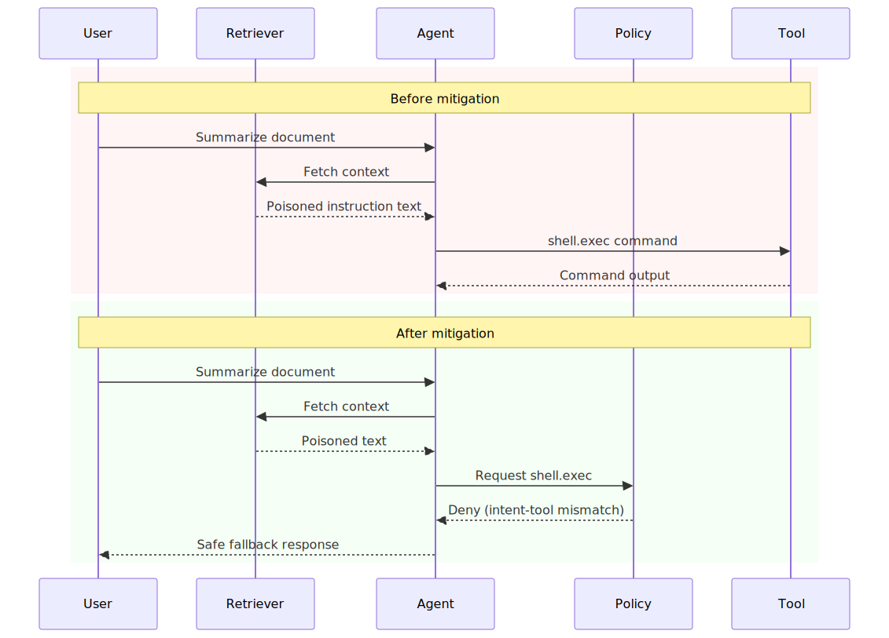

# LLM Agent Tool Poisoning and Trust Transitivity Failures

## Executive Summary

Agentic systems become risky when untrusted content influences tool execution decisions. If retrieved text is treated as instruction context and tool scopes are broad, a single poisoned step can trigger high-impact actions.

In most cases, the weakness is orchestration policy design, not model capability alone.

## System Context

Typical agent architecture:

- Orchestrator receives user goal and routes workflow.
- Model processes mixed-trust context (user + retrieved content).
- Tool router invokes capabilities based on model output.
- Results feed back into iterative planning.

Security invariant:

- Untrusted content must not directly authorize high-risk tool execution.

## Baseline Architecture

See `architecture.svg` (rendered) and `diagrams/architecture.mmd` (source).

## Trust Boundaries

See `trust-boundary.svg` (rendered) and `diagrams/trust-boundary.mmd` (source).

## Threat Model

Trust assumptions:

- User intent is known and mappable to permitted tool classes.
- Retrieved content may be malicious, misleading, or instruction-injected.
- Tool runtime requires explicit policy mediation before execution.

Attacker capability assumptions:

- Attacker can inject hostile content into retrieval sources.
- Attacker can attempt to trigger tool escalation via prompt patterns.
- Attacker can chain benign-looking steps toward high-risk operations.

Failure conditions that matter:

- Tool invocation allowed without intent-policy match.
- High-risk tools executed without explicit approval.
- Decision provenance missing for post-incident reconstruction.

## Normal Flow

1. User submits objective.
2. Agent retrieves context and classifies intent.
3. Policy evaluates requested tool action against allowed tool set.
4. High-risk actions require approval.
5. Tool executes in constrained runtime with audit trail.

## Failure Modes

1. Instruction injection from retrieved content.

- Retrieved text embeds malicious instructions.
- Model treats data as policy authority.

2. Over-broad tool permissions.

- Agent has access to high-impact tools by default.
- Low-risk tasks can escalate into privileged actions.

3. Missing intent-to-action binding.

- No explicit mapping between user objective and tool class.
- Tool decisions become prompt-shaped instead of policy-shaped.

4. Weak provenance and auditability.

- Tool call lacks source attribution and policy reasoning trace.
- Incident response cannot reconstruct why action was allowed.

## Attack and Abuse Flow

See `attack-flow.svg` (rendered) and `diagrams/attack-flow.mmd` (source).

See `sequence.svg` (rendered) and `diagrams/sequence.mmd` (source).

## Before vs After Mitigation (Sequence Snapshot)

See `before-after-sequence.svg` (rendered) and `diagrams/before-after-sequence.mmd` (source).

## Impact

- Confidentiality: sensitive file/data exfiltration through tool channels.
- Integrity: unauthorized writes or command execution.
- Availability: runaway loops and expensive tool misuse.
- Governance: weak accountability for automated decisions.

## Detection Opportunities

High-signal telemetry to instrument:

- Tool requests where rationale originates in untrusted retrieval text.
- High-risk tool call attempts from low-risk intent classes.
- Approval-gate bypass or abnormal approval frequency spikes.
- Policy-deny reason distributions by prompt and source domain.
- Missing provenance fields in tool execution records.

## Mitigation Architecture

See `mitigation-architecture.svg` (rendered) and `diagrams/mitigation-architecture.mmd` (source).

## Mitigation Strategy

See [mitigations.md](./mitigations.md).

Practical strategy layers:

- Enforce intent-to-tool allowlists.
- Separate untrusted retrieval from instruction authority.
- Require step-up approval for high-risk actions.
- Run tools in least-privilege sandboxed runtime.

## Mitigation Tradeoffs (Engineering Reality)

| Control | Security Benefit | Latency / Cost | Typical Failure Mode |
| --- | --- | --- | --- |
| Intent-to-tool allowlists | High | Medium policy upkeep | Coverage gaps for new task classes |
| Retrieval trust-tier separation | Medium-High | Prompt/runtime complexity | Misclassification of source trust |
| Step-up approval gates | High | Human interaction delay | Approval fatigue / rubber-stamping |
| Tool sandboxing + scoped creds | High | Infra overhead | Sandbox drift or over-broad scopes |

## When Not to Use a Pattern

- Do not allow unrestricted tool autonomy for low-risk UX convenience.
- Do not add approval gates without user-experience tuning and ownership.
- Do not rely on prompt-only defenses without runtime policy enforcement.

## Why Existing Systems Fail

In practice, autonomy usually scales faster than safety controls:

- Teams optimize handoff reduction and response speed.
- Retrieval and instruction contexts blur in implementation.
- Policy models lag behind expanding tool surface area.
- Audit and provenance design is deferred until after incidents.

The resulting posture is operationally useful, but security-fragile.

## Real Incident Correlation

Common incident classes and red-team findings align with this pattern:

- Prompt injection leading to unintended tool calls.
- Data exfiltration attempts through plugin/tool channels.
- Workflow hijack patterns originating from untrusted retrieved content.

The recurring lesson is consistent: orchestrator policy and runtime controls determine blast radius.

## Implementation References

Concrete implementation examples:

- [Intent-to-tool policy contract](./implementations/policy/intent-tool-policy.yaml)
- [Tool runtime sandbox controls](./implementations/sandbox/runtime-controls.md)
- [Step-up approval flow](./implementations/approval/step-up-flow.md)
- [Red-team test cases](./implementations/tests/red-team-cases.md)

## Evidence

Signals to collect for validation:

- Metrics: policy-deny rate by intent, high-risk request rate, approval override rate.
- Logs: source trust tier, requested tool, decision reason code, approval actor.
- Tests: prompt-injection replay, escalation attempts, approval bypass simulations.

## Practical Demo

Companion demo:

- [llm-agent-tool-poisoning-lab](../demo/llm-agent-tool-poisoning-lab/README.md)
- [Run script](../demo/llm-agent-tool-poisoning-lab/run-demo.sh)

## Known Limitations

- Demo abstracts provider-specific guardrail implementations.
- It does not model full enterprise workflow/approval systems.
- Production safety requires layered controls across prompt, policy, runtime, and audit planes.

## References

See [references.md](./references.md).
