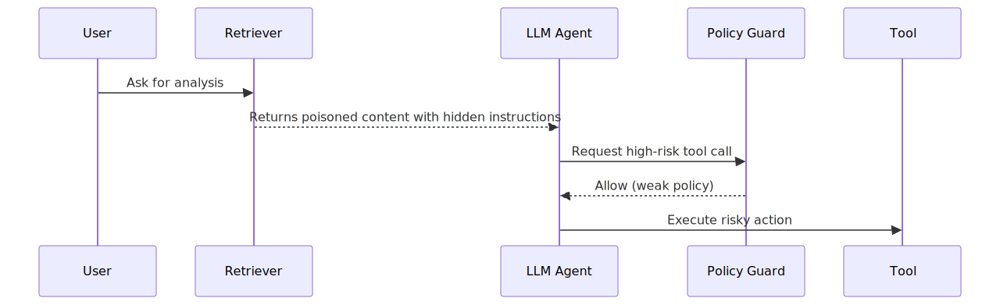
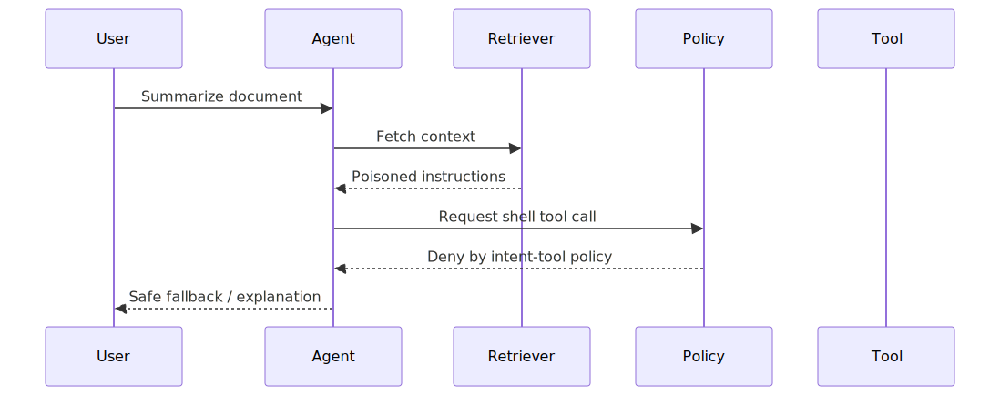

# LLM Agent Tool Poisoning and Trust Transitivity Failures

## Executive Summary

LLM-agent systems fail when untrusted content can influence tool invocation decisions without strong policy mediation. Prompt/tool poisoning often exploits trust transitivity: data from web/docs/tickets/chats is treated as instructions, and agent orchestration forwards those instructions to powerful tools.

This is a control-plane design failure across model reasoning, tool permissions, and execution governance.

## System Context

Typical agent architecture:
- orchestrator receives user goal
- model reads mixed-trust context (user input, retrieved docs, external pages)
- tool router selects and executes tools
- results loop back to model for next actions

Security invariant:
- untrusted content must never become implicit authority for tool execution

## Baseline Architecture

See `architecture.svg` (rendered) and `diagrams/architecture.mmd` (source).

## Normal Flow

1. User submits objective.
2. Agent retrieves context.
3. Model proposes actions.
4. Policy guard evaluates tool request.
5. Approved tool executes with constrained scope.

## Failure Modes

1. Instruction injection from retrieved content
- malicious text says "run shell command" or "exfiltrate secrets"
- model follows as if system-authorized instruction

2. Over-broad tool permissions
- agent has filesystem/network/tool access unrelated to current task

3. Missing intent-to-action policy binding
- no explicit mapping from user intent to allowed tool classes

4. No provenance tracking
- execution logs do not show which source content triggered tool call

## Attack/Abuse Flow

See `attack-flow.svg` (rendered) and `diagrams/attack-flow.mmd` (source).

See `sequence.svg` (rendered) and `diagrams/sequence.mmd` (source).

## Impact

- Confidentiality: secret/file exfiltration through tool calls.
- Integrity: unauthorized modifications via command execution.
- Availability: destructive or expensive tool loops.
- Governance: inability to prove safe decision boundaries.

## Detection Opportunities

- tool calls whose justification text originates from untrusted retrieval chunks
- sudden jumps to high-risk tools without prior explicit user authorization
- deviations from expected tool-use policy per task type
- anomalous high-privilege tool invocation patterns

## Mitigation Strategy

See [mitigations.md](./mitigations.md).

## Why Existing Systems Fail

Agent systems fail when safety and utility are tuned independently:
- Teams optimize tool autonomy before strict intent-policy mapping.
- Retrieved untrusted text is blended with instruction context.
- Broad tool scopes are granted to reduce human handoff latency.
- Logging captures outputs but not decision provenance.

Without explicit trust-tier controls, convenience paths become exploit paths.

## Real Incident Correlation

Observed incidents and public red-team findings commonly involve:
- Prompt injection causing unintended tool invocation.
- Data exfiltration attempts via plugin/tool channels.
- Agent workflow hijack through untrusted retrieval content.

The recurring issue is orchestration trust design, not model capability alone.

## Practical Demo

Companion lab:
- [llm-agent-tool-poisoning-lab](../demo/llm-agent-tool-poisoning-lab/README.md)

## References

See [references.md](./references.md).
