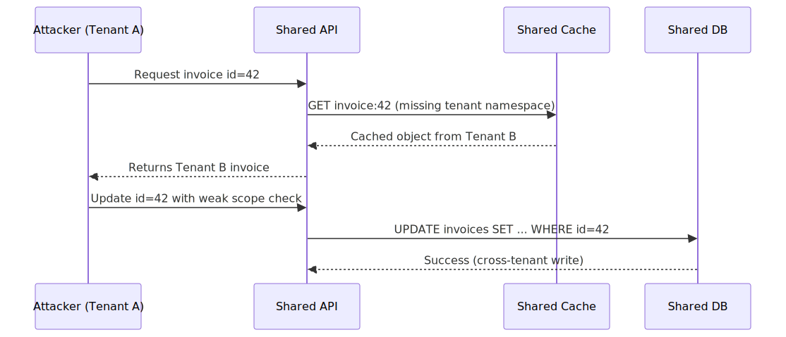
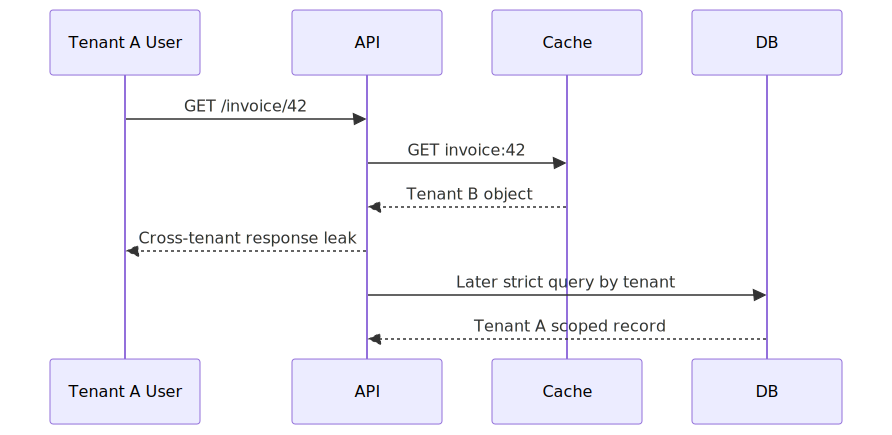

# Multi-Tenant SaaS Isolation Failures

## Executive Summary

Multi-tenant isolation breaks when tenant context is treated as optional application metadata instead of a cryptographically or policy-bound security boundary. The result is cross-tenant data exposure through query scoping mistakes, cache key collisions, shared control-plane paths, or confused authorization flows.

## System Context

Typical architecture:
- shared API and worker tiers
- shared database with row-level tenant segregation
- shared cache and queue infrastructure
- tenant context passed via JWT claims and request headers

Security invariant:
- every read/write must be constrained by authenticated tenant identity

## Baseline Architecture

See `architecture.svg` (rendered) and `diagrams/architecture.mmd` (source).

## Normal Flow

1. User authenticates and receives token with `tenant_id`.
2. API extracts tenant context and authorization scope.
3. Query/data access layer enforces tenant filter.
4. Cache keys include tenant namespace.
5. Response returns tenant-scoped data only.

## Failure Modes

1. Missing tenant predicate in one code path
- an endpoint uses `resource_id` without `tenant_id` filter
- attacker iterates predictable IDs to access foreign tenant records

2. Cache namespace collision
- key is `invoice:{id}` instead of `tenant:{tenant_id}:invoice:{id}`
- tenant A receives tenant B data from cache

3. Internal service trust confusion
- downstream service trusts forwarded `X-Tenant-ID` header without verifying caller/service identity

4. Background job context leakage
- queue consumer reuses stale execution context and applies wrong tenant scope

## Attack/Abuse Flow

See `attack-flow.svg` (rendered) and `diagrams/attack-flow.mmd` (source).

See `sequence.svg` (rendered) and `diagrams/sequence.mmd` (source).

## Impact

- Confidentiality: cross-tenant data leakage.
- Integrity: cross-tenant updates/deletes.
- Compliance: contractual and regulatory breach.
- Business: severe trust and platform reputation damage.

## Detection Opportunities

- queries returning records where `token.tenant_id != row.tenant_id`
- cache hit anomalies across tenant namespaces
- tenant-switch patterns from same principal/device within short windows
- shadow authorization logs for denied cross-tenant attempts

## Mitigation Strategy

See [mitigations.md](./mitigations.md).

## Why Existing Systems Fail

Tenant isolation failures often emerge from scale and product pressure:
- Shared infrastructure is chosen to control cost and simplify operations.
- Teams introduce caches and async workers before tenant-context controls are fully standardized.
- One unscoped query path can bypass an otherwise strong model.
- Legacy service contracts preserve mutable headers and weak context propagation.

Isolation erodes gradually unless boundaries are enforced by default in data and policy layers.

## Real Incident Correlation

This pattern maps to well-known classes of incidents:
- Cross-tenant data leakage from cache-key collisions.
- Mis-scoped data access due to missing tenant predicates.
- Cloud IAM or policy misconfiguration exposing one tenant’s data to another.

The recurring theme is control inconsistency across API, cache, worker, and data paths.

## Practical Demo

Companion lab:
- [multi-tenant-isolation-lab](../demo/multi-tenant-isolation-lab/README.md)

## References

See [references.md](./references.md).
