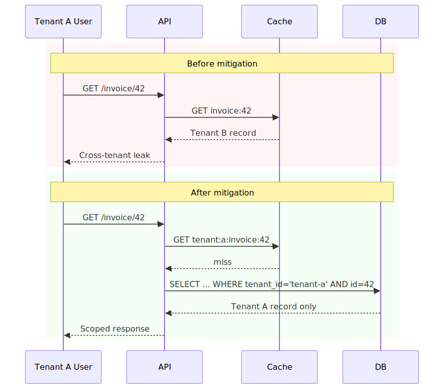

# Multi-Tenant SaaS Isolation Failures

## Executive Summary

Multi-tenant isolation usually fails through small integration gaps, not dramatic exploit chains: one unscoped query, one cache key without tenant namespace, one async job processed without validated tenant context. Those local mistakes can produce platform-wide cross-tenant exposure.

The core issue is consistency of tenant-boundary enforcement across API, cache, worker, and data layers.

## System Context

Typical architecture:

- Shared API and worker tiers.
- Shared database with tenant partitioning.
- Shared cache and queue infrastructure.
- Tenant context propagated via identity claims and internal request metadata.

Security invariant:

- Every read/write must be constrained by authenticated tenant identity.

## Baseline Architecture

See `architecture.svg` (rendered) and `diagrams/architecture.mmd` (source).

## Trust Boundaries

See `trust-boundary.svg` (rendered) and `diagrams/trust-boundary.mmd` (source).

## Threat Model

Trust assumptions:

- Tenant identity is present and verified on every request path.
- Shared infrastructure preserves tenant context without mutation/loss.
- Data-plane access layers enforce tenant scope by default.

Attacker capability assumptions:

- Attacker controls a valid account in one tenant.
- Attacker can probe predictable IDs and endpoint behavior.
- Attacker can exploit context propagation gaps across cache/worker paths.

Failure conditions that matter:

- Query path omits tenant predicate.
- Cache keys are not tenant namespaced.
- Async execution consumes stale or missing tenant context.

## Normal Flow

1. User authenticates and receives tenant-scoped identity claims.
2. API extracts tenant context and authorization scope.
3. Data access layer enforces tenant predicate on read/write queries.
4. Cache and queue keys include tenant namespace.
5. Response returns tenant-scoped data only.

## Failure Modes

1. Missing tenant predicate in one code path.

- Endpoint uses `resource_id` without tenant scope constraint.
- Attacker enumerates IDs and accesses another tenant’s records.

2. Cache namespace collision.

- Key pattern `invoice:{id}` used instead of `tenant:{tenant_id}:invoice:{id}`.
- Cached response for tenant B is served to tenant A.

3. Internal service context confusion.

- Downstream service trusts mutable tenant headers without caller verification.
- Service-to-service call path bypasses stronger edge controls.

4. Background job context leakage.

- Worker reuses stale execution context from previous job.
- Tenant scope applied incorrectly for read/write side effects.

## Attack and Abuse Flow

See `attack-flow.svg` (rendered) and `diagrams/attack-flow.mmd` (source).

See `sequence.svg` (rendered) and `diagrams/sequence.mmd` (source).

## Before vs After Mitigation (Sequence Snapshot)

See `before-after-sequence.svg` (rendered) and `diagrams/before-after-sequence.mmd` (source).

## Impact

- Confidentiality: cross-tenant data leakage.
- Integrity: cross-tenant writes/deletes.
- Compliance: contractual and regulatory exposure.
- Business: customer trust and platform reputation damage.

## Detection Opportunities

High-signal telemetry to instrument:

- Responses where token tenant and data tenant do not match.
- Cache-hit anomalies across tenant namespaces for same object IDs.
- Cross-tenant access probes from a single principal/device/time window.
- Worker job execution where tenant context is null/malformed.
- Query logs missing tenant predicates on tenant-scoped tables.

## Mitigation Architecture

See `mitigation-architecture.svg` (rendered) and `diagrams/mitigation-architecture.mmd` (source).

## Mitigation Strategy

See [mitigations.md](./mitigations.md).

Practical strategy layers:

- Enforce tenant-scoped data access abstractions.
- Use tenant-namespaced cache and queue conventions.
- Validate signed tenant context on service-to-service calls.
- Add data-layer policies (for example RLS) as hard backstop.

## Mitigation Tradeoffs (Engineering Reality)

| Control | Security Benefit | Latency / Cost | Typical Failure Mode |
| --- | --- | --- | --- |
| Tenant-scoped DAL guards | High | Low-Medium engineering overhead | Bypass through raw SQL or legacy path |
| Cache namespacing | Medium-High | Low keyspace overhead | Inconsistent adoption across services |
| Data-layer RLS policy | High | Medium query planning overhead | Misconfigured policy or privileged bypass role |
| Worker context validation | Medium-High | Medium async complexity | Context contract drift between producers/consumers |

## When Not to Use a Pattern

- Do not rely only on application-layer tenant checks without data-layer backstops for high-risk datasets.
- Do not deploy RLS blindly where role model and migration tooling are not ready.
- Do not over-fragment tenant isolation controls without shared context contracts and testing discipline.

## Why Existing Systems Fail

Teams usually make rational local tradeoffs that accumulate isolation debt:

- Shared infrastructure is essential for cost and velocity.
- Performance work lands before authz abstractions are fully mature.
- Compatibility constraints keep mutable context contracts alive.
- One weak path can bypass multiple strong controls.

Isolation quality is determined by the weakest enforcement point, not the average one.

## Real Incident Correlation

Industry incidents repeatedly follow this shape:

- Cross-tenant leakage from cache-key collisions.
- Access-control drift where one query path missed tenant scoping.
- IAM/policy misconfiguration exposing data between customer tenants.

These are usually systems-integration failures, not isolated coding mistakes.

## Implementation References

Concrete implementation examples:

- [PostgreSQL RLS policy example](./implementations/postgres/rls.sql)
- [Cache namespacing pattern](./implementations/cache/namespacing.md)
- [API tenant-context contract](./implementations/api-policy/context-contract.yaml)
- [Isolation test cases](./implementations/tests/isolation-test-cases.md)

## Evidence

Signals to collect for validation:

- Metrics: cross-tenant deny rate, missing-tenant-context rate, unscoped query detection rate.
- Logs: token tenant, resolved tenant context, data-row tenant, decision reason code.
- Tests: ID enumeration probes, cache collision simulations, worker context corruption tests.

## Practical Demo

Companion demo:

- [multi-tenant-isolation-lab](../demo/multi-tenant-isolation-lab/README.md)
- [Run script](../demo/multi-tenant-isolation-lab/run-demo.sh)

## Known Limitations

- Demo uses simplified schemas and tenancy metadata.
- It does not model full policy-engine, legal, and data-governance controls.
- Production posture should validate API, cache, worker, and data-plane controls together.

## References

See [references.md](./references.md).
