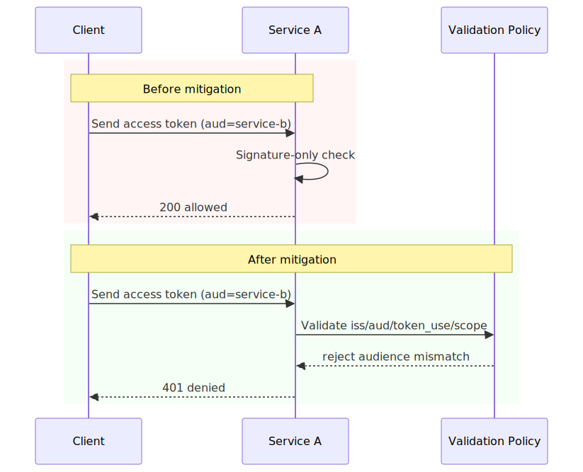

# OAuth Token Confusion in Distributed Services

## Executive Summary

OAuth token confusion appears when token validity is checked but token intent is not. Signatures verify, expiry checks pass, and yet the token should not have been accepted for that endpoint: wrong audience, wrong token type, wrong scope context, or wrong issuer boundary.

The failure usually sits in policy precision between identity and application layers, not in cryptography itself.

## System Context

Typical system architecture:

- Identity provider issues ID tokens and access tokens.
- API gateway and backend services validate JWT structure and signature.
- Multiple resource servers exist with service-specific audience and scope expectations.

Expected invariant:

- Each endpoint accepts only the token type and audience explicitly intended for that resource.

## Baseline Architecture

See `architecture.svg` (rendered) and `diagrams/architecture.mmd` (source).

## Trust Boundaries

See `trust-boundary.svg` (rendered) and `diagrams/trust-boundary.mmd` (source).

## Threat Model

Trust assumptions:

- Token signatures and issuer keys are validated correctly.
- Resource servers maintain strict audience and token-use rules.
- Scope checks are mapped to operation-level authorization intent.

Attacker capability assumptions:

- Attacker can obtain a valid token (ID token or access token for another audience).
- Attacker can replay tokens across services and endpoint classes.
- Attacker cannot forge signatures, but can exploit permissive acceptance rules.

Failure conditions that matter:

- ID token accepted on API authorization path.
- Audience mismatch tolerated by shared middleware.
- Scope checks applied inconsistently across services.

## Normal Flow

1. Client receives ID token (client identity context) and access token (API authorization context).
2. Client calls API with access token.
3. Resource server verifies signature, issuer, audience, expiry, token use, and scopes.
4. Authorization decision is evaluated against operation-level policy.

## Failure Modes

1. ID token accepted as access token.

- Signature and expiry pass, token intent is not validated.
- Endpoint accepts identity context where authorization context is required.

2. Audience confusion.

- Service A accepts token minted for Service B.
- Cross-service token replay becomes viable.

3. Issuer and tenant drift.

- Broad trust configuration accepts tokens from unintended issuer context.
- Service boundary assumptions collapse under multi-tenant or multi-issuer conditions.

4. Scope and action mismatch.

- Token carries valid identity but insufficient scope for requested operation.
- Endpoint allows action due to coarse or inconsistent policy mapping.

## Attack and Abuse Flow

See `attack-flow.svg` (rendered) and `diagrams/attack-flow.mmd` (source).

See `sequence.svg` (rendered) and `diagrams/sequence.mmd` (source).

## Before vs After Mitigation (Sequence Snapshot)

See `before-after-sequence.svg` (rendered) and `diagrams/before-after-sequence.mmd` (source).

## Impact

- Confidentiality: unauthorized data access through token replay/misuse.
- Integrity: operations executed under wrong authorization context.
- Lateral movement: valid tokens reused across unintended service boundaries.
- Audit quality: logs show valid signature acceptance but hide intent mismatch.

## Detection Opportunities

High-signal telemetry to instrument:

- Access-token `aud` mismatch events by endpoint class.
- ID-token claim shape observed on API authorization routes.
- Scope-deny vs scope-allow divergence between services for same operation.
- Issuer variance anomalies by route or tenant segment.
- Policy decision reason codes for token-use mismatch.

## Mitigation Architecture

See `mitigation-architecture.svg` (rendered) and `diagrams/mitigation-architecture.mmd` (source).

## Mitigation Strategy

See [mitigations.md](./mitigations.md).

Practical strategy layers:

- Enforce strict issuer/audience/token-use validation before authorization.
- Isolate audiences per resource server.
- Centralize validation contracts and endpoint policy tests.
- Bind scopes to operation-level decisions, not route-level assumptions.

## Mitigation Tradeoffs (Engineering Reality)

| Control | Security Benefit | Latency / Cost | Typical Failure Mode |
| --- | --- | --- | --- |
| Strict claim profile validation | High | Low | Legacy clients break on stricter policy |
| Per-service audience isolation | High | Medium migration cost | Partial rollout leaves replay windows |
| Centralized middleware contracts | Medium-High | Medium governance overhead | Bypass via custom/legacy handlers |
| Fine-grained scope-action mapping | High | Medium policy complexity | Scope taxonomy drift across teams |

## When Not to Use a Pattern

- Do not reuse a shared audience across unrelated high-risk services for convenience.
- Do not accept ID tokens on API routes to reduce client integration effort.
- Do not centralize validation logic without contract tests that block service-level bypasses.

## Why Existing Systems Fail

This failure usually emerges from practical delivery pressure:

- Shared middleware starts with signature checks and grows slower than service complexity.
- Audience reuse feels simpler during rapid service growth.
- Compatibility exceptions accumulate and become default behavior.
- Identity and service teams own different layers of the decision path.

What breaks is rarely JWT decoding. What breaks is policy precision and lifecycle discipline.

## Real Incident Correlation

Common incident classes that map to this pattern:

- Tokens accepted by unintended resource servers due to audience validation gaps.
- ID-token acceptance on API paths intended for access-token authorization.
- Scope and policy drift across services creating inconsistent access decisions.

The lesson is consistent across postmortems: cryptographic validity is necessary, but it is not sufficient for authorization correctness.

## Implementation References

Concrete implementation examples:

- [Gateway validation pseudocode](./implementations/gateway/pseudocode.md)
- [Validation schema contract](./implementations/middleware/validation_schema.yaml)
- [OPA policy example](./implementations/opa/policy.rego)
- [Contract test cases](./implementations/tests/contract-test-cases.md)

## Evidence

Signals to collect for validation:

- Metrics: audience-mismatch deny rate, token-use mismatch rate, cross-service policy divergence.
- Logs: `iss`, `aud`, `token_use`, `scope`, and deny reason code.
- Tests: ID-token replay, audience swap replay, scope downgrade attempts.

## Practical Demo

Companion demo:

- [oauth-token-confusion-lab](../demo/oauth-token-confusion-lab/README.md)
- [Run script](../demo/oauth-token-confusion-lab/run-demo.sh)

## Known Limitations

- Demo focuses on token-intent confusion and does not cover all grant-type edge cases.
- It does not model full enterprise IdP complexity (conditional access, tenant routing, risk scoring).
- Mitigations require consistent policy rollout across all services, not isolated endpoints.

## References

See [references.md](./references.md).
