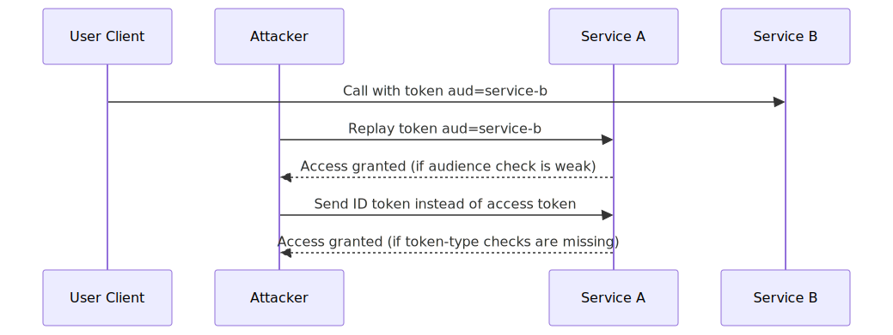
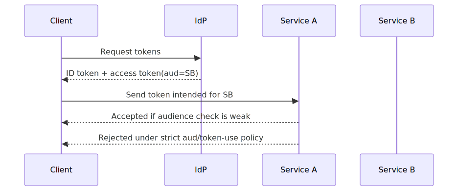

# OAuth Token Confusion in Distributed Services

## Executive Summary

OAuth token confusion tends to appear when service ecosystems grow faster than token-policy discipline. Signature checks pass, but token intent is wrong: ID token where access token was expected, wrong audience accepted, or scope interpretation too loose.

The failure is usually policy ambiguity between identity and application layers.

## System Context

Typical system architecture:
- identity provider issues ID token and access token
- API gateway or backend validates JWT structure/signature
- multiple resource servers exist with different audiences/scopes

Expected invariant:
- each endpoint accepts only the token type and audience explicitly intended for it

## Baseline Architecture

See `architecture.svg` (rendered) and `diagrams/architecture.mmd` (source).

## Normal Flow

1. Client receives ID token (for client authentication context) and access token (for API access).
2. Client calls API with access token.
3. API verifies signature, issuer, audience, expiry, and scopes.
4. API authorizes operation based on claims and policy.

## Failure Modes

1. ID token accepted as access token
- backend checks signature/expiry only
- ignores token type (`typ`) and intended use

2. Audience confusion
- service accepts token with `aud=service-b` at `service-a`
- cross-service replay becomes possible

3. Weak issuer/tenant checks
- token from different issuer/tenant accepted due to broad JWKS trust

4. Scope and subject confusion
- token has valid identity but insufficient scope; endpoint authorizes anyway

## Attack/Abuse Flow

See `attack-flow.svg` (rendered) and `diagrams/attack-flow.mmd` (source).

See `sequence.svg` (rendered) and `diagrams/sequence.mmd` (source).

## Impact

- Confidentiality: unauthorized data access via replayed/misused tokens.
- Integrity: actions performed with wrong trust context.
- Lateral movement: token replay between services with overlapping trust assumptions.
- Audit ambiguity: valid signatures hide invalid token intent.

## Detection Opportunities

- token usage where `aud` does not match target service
- ID-token-like claims observed on API authorization paths
- high rate of denied/accepted mismatches on scope checks
- issuer variance anomalies per endpoint

## Mitigation Strategy

See [mitigations.md](./mitigations.md).

## Why Existing Systems Fail

This problem usually emerges from scale and compatibility pressure:

- Shared middleware verifies cryptographic validity but omits strict token-use semantics.
- Audience reuse across services looks convenient during early growth.
- Backward-compatibility exceptions accumulate and outlive their risk review.
- Identity and service owners often govern different parts of the decision path.

What breaks is not JWT parsing; what breaks is policy precision.

## Real Incident Correlation

Real-world OAuth failures often involve:

- Token replay against unintended resource servers.
- ID-token misuse on API authorization paths.
- Scope or audience drift across service boundaries over time.

The repeating pattern is permissive acceptance logic, not cryptographic weakness.

## Evidence

Signals to collect for validation:

- Metrics: `time-to-final-reject`, `policy-deny-rate`, and cross-replica decision divergence.
- Logs: identity context, enforcement path, and reason code for allow/deny decisions.
- Tests: replay, propagation-delay, and failover behavior under sustained load.

## Practical Demo

Companion demo:

- [oauth-token-confusion-lab](../demo/oauth-token-confusion-lab/README.md)
- [Run script](../demo/oauth-token-confusion-lab/run-demo.sh)

## Known Limitations

- The demo focuses on audience/token-use confusion and does not cover every OAuth grant edge case.
- It omits full IdP-side policy complexity such as conditional access and tenant routing.
- Mitigations depend on strict policy rollout across all services, not just one endpoint.

## References

See [references.md](./references.md).
