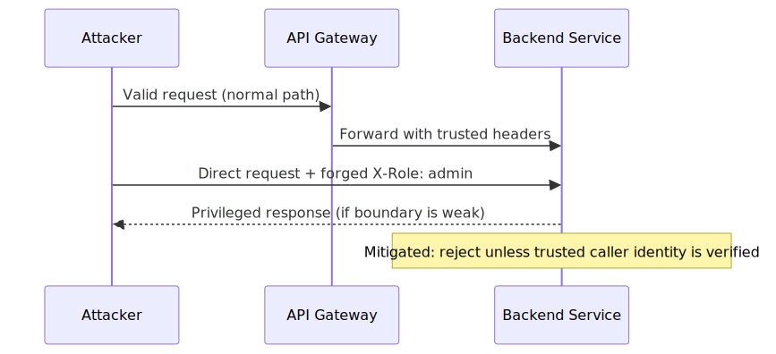

# security-architecture-patterns

  

Security architecture research repository focused on how modern systems fail at scale and how to design resilient, measurable mitigations.

## Start Here

1. Read [METHODOLOGY.md](./METHODOLOGY.md) for analysis standards.
2. Start with [JWT Revocation Failure](./JWT-Revocation-Failure/README.md) as the flagship deep-dive.
3. Use [PATTERN-INDEX.md](./PATTERN-INDEX.md) to navigate cross-topic patterns.
4. Run companion demonstrations from [demo/](./demo/).

## Repository Scope

This repository is an architecture research platform.

It focuses on:
- distributed identity and trust failures
- multi-tenant boundary breakdowns
- control-plane and software supply-chain risk
- agentic and zero-trust implementation failures

## Who This Is For

Designed for:
- Security architects
- Staff+ engineers
- Platform security teams
- Cloud-native engineering teams
- Security researchers

## Research Principles

- Architecture-first analysis.
- Realistic operational assumptions.
- Distributed-systems perspective.
- Tradeoff-aware security engineering.
- Defensive and educational focus.

## What You Will Find

Each case study is built as a repeatable analysis unit with:
- architecture context
- failure mode and abuse path
- operational impact and detection signals
- mitigation patterns and tradeoff analysis
- references for verification

## Visual Examples

JWT Revocation Failure - Baseline Architecture:

API Gateway Trust Boundaries - Attack Flow:

## Case Studies

1. [JWT Revocation Failure](./JWT-Revocation-Failure/README.md)
2. [Multi-Tenant SaaS Isolation](./Multi-Tenant-SaaS-Isolation/README.md)
3. [API Gateway Trust Boundaries](./API-Gateway-Trust-Boundaries/README.md)
4. [OAuth Token Confusion](./OAuth-Token-Confusion/README.md)
5. [CI/CD Supply Chain Risk](./CI-CD-Supply-Chain-Risk/README.md)
6. [LLM Agent Tool Poisoning](./LLM-Agent-Tool-Poisoning/README.md)
7. [Zero Trust Architecture Mistakes](./Zero-Trust-Architecture-Mistakes/README.md)

Cross-cutting index:
- [PATTERN-INDEX.md](./PATTERN-INDEX.md)

## Standard Topic Structure

Each topic directory includes:
- `README.md`
- `architecture.svg`
- `attack-flow.svg`
- `sequence.svg`
- `mitigations.md`
- `references.md`
- `diagrams/architecture.mmd`
- `diagrams/attack-flow.mmd`
- `diagrams/sequence.mmd`

## Companion Demos

Practical simulations are maintained inside this repository:
- [demo/](./demo/)

## Working Standards

- [METHODOLOGY.md](./METHODOLOGY.md)
- [ROADMAP.md](./ROADMAP.md)
- [CONTRIBUTING.md](./CONTRIBUTING.md)

## Responsible Use Disclaimer

This repository is provided for educational and defensive security purposes only.

The content is intended to support:
- security architecture learning
- threat modeling and design review
- resilience engineering and risk reduction

It is not intended to enable unauthorized access, exploitation, or any malicious activity. Use these materials only in legal, authorized, and ethical environments.
