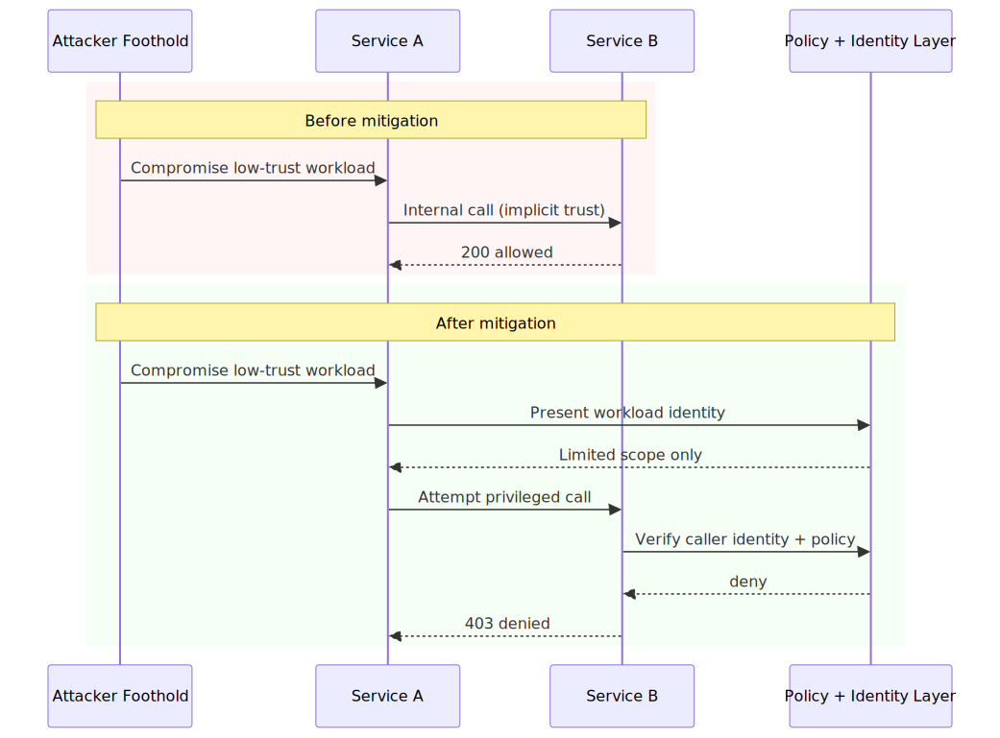

# Zero Trust Architecture Mistakes in Real Deployments

## Executive Summary

Many zero-trust programs look strong in architecture decks and weak in runtime behavior. User ingress is hardened, yet east-west service paths still rely on implicit trust, stale exceptions, or incomplete workload identity controls.

The real gap is usually policy-intent versus policy-enforcement consistency.

## System Context

Typical enterprise architecture:

- SSO and MFA at user ingress.
- Segmented networks with partial microsegmentation.
- Mixed legacy and cloud-native workloads.
- Service-to-service traffic with uneven identity enforcement.

Zero trust invariant:

- Every access decision should be continuously verified with strong identity, context, and policy.

## Baseline Architecture

See `architecture.svg` (rendered) and `diagrams/architecture.mmd` (source).

## Trust Boundaries

See `trust-boundary.svg` (rendered) and `diagrams/trust-boundary.mmd` (source).

## Threat Model

Trust assumptions:

- Strong identity controls exist at user ingress.
- Internal service identity is consistently verifiable.
- Policy decisions are enforced uniformly across hops.

Attacker capability assumptions:

- Attacker can compromise one internal workload.
- Attacker can probe east-west paths and service trust assumptions.
- Attacker can exploit stale exception rules and policy drift.

Failure conditions that matter:

- Internal calls allowed by network location instead of verified identity.
- Workload identity absent or not enforced on sensitive service routes.
- Exception policies outlive risk review and become implicit permanent allow paths.

## Normal Flow

1. User/workload authenticates.
2. Policy engine evaluates context and risk.
3. Access is granted with least privilege.
4. Continuous signals re-evaluate trust posture over time.

## Failure Modes

1. Perimeter-only verification.

- Strong user login controls, weak internal service auth.
- Attacker foothold inside network can move laterally.

2. Flat east-west trust.

- Workloads on same segment communicate broadly by default.
- Service boundary enforcement is inconsistent or missing.

3. Static long-lived credentials.

- No continuous verification on context/risk changes.
- Credential replay remains viable during policy drift windows.

4. Exception-path creep.

- Emergency allow rules persist beyond intended duration.
- Exception registry becomes hidden privilege expansion mechanism.

## Attack and Abuse Flow

See `attack-flow.svg` (rendered) and `diagrams/attack-flow.mmd` (source).

See `sequence.svg` (rendered) and `diagrams/sequence.mmd` (source).

## Before vs After Mitigation (Sequence Snapshot)

See `before-after-sequence.svg` (rendered) and `diagrams/before-after-sequence.mmd` (source).

## Impact

- Confidentiality: lateral movement to sensitive services and data stores.
- Integrity: unauthorized internal operations under over-trusted identities.
- Availability: broad blast radius in ransomware-style propagation scenarios.
- Governance: compliance posture appears stronger than actual runtime controls.

## Detection Opportunities

High-signal telemetry to instrument:

- East-west service calls lacking workload identity proof.
- Unexpected service-to-service allow decisions from low-trust principals.
- Exception rule usage frequency and expiry overrun rate.
- Policy-decision drift between central policy engine and local enforcement points.
- Lateral movement path growth over time by service graph analysis.

## Mitigation Architecture

See `mitigation-architecture.svg` (rendered) and `diagrams/mitigation-architecture.mmd` (source).

## Mitigation Strategy

See [mitigations.md](./mitigations.md).

Practical strategy layers:

- Enforce workload identity and mTLS on sensitive east-west routes.
- Align policy decision and local enforcement behavior per hop.
- Introduce exception lifecycle governance with expiry and ownership.
- Add continuous verification signals into runtime access decisions.

## Mitigation Tradeoffs (Engineering Reality)

| Control | Security Benefit | Latency / Cost | Typical Failure Mode |
| --- | --- | --- | --- |
| Workload identity + mTLS | High | Cert lifecycle and operational overhead | Legacy incompatibility or partial rollout |
| Policy parity across hops | High | Medium integration complexity | Drift between central and local policy versions |
| Continuous access re-evaluation | Medium-High | Telemetry and control-plane overhead | Alert noise and risk-score instability |
| Exception TTL governance | Medium-High | Process overhead | Ownerless exceptions and delayed cleanup |

## When Not to Use a Pattern

- Do not force blanket mTLS everywhere at once in legacy-heavy estates without staged rollout.
- Do not centralize all decisions without local fail-safe behavior for policy-plane outages.
- Do not run continuous risk evaluation without tuning or teams may bypass controls due alert fatigue.

## Why Existing Systems Fail

These gaps usually come from sequencing and operational friction:

- User auth hardening is easier than workload identity rollout.
- East-west migration is technically harder than edge hardening.
- Exception rules created during incidents often remain beyond intended use.
- Legacy services resist identity and policy integration without dedicated ownership.

The outcome is uneven enforcement hidden beneath strong top-level messaging.

## Real Incident Correlation

Common enterprise incident classes fit this model:

- Lateral movement after foothold despite strong SSO/MFA at ingress.
- Internal service abuse through broad trust in network location.
- Exception-driven access expansion without expiration governance.

The key lesson is operational: zero trust succeeds only when runtime verification is continuous and enforceable, not when perimeter controls are merely strong.

## Implementation References

Concrete implementation examples:

- [SPIFFE identity policy example](./implementations/spiffe/spiffe-policy-example.md)
- [Microsegmentation network policy](./implementations/microsegmentation/network-policy-example.yaml)
- [Policy decision contract](./implementations/policy/decision-contract.yaml)
- [Exception TTL governance pattern](./implementations/exceptions/ttl-governance.md)

## Evidence

Signals to collect for validation:

- Metrics: unauthorized east-west deny rate, exception-overrun rate, policy-drift incidence.
- Logs: caller identity, decision source, policy version, exception rule linkage.
- Tests: lateral movement simulation, exception expiry enforcement tests, compromised workload exercises.

## Practical Demo

Companion demo:

- [zero-trust-mistakes-lab](../demo/zero-trust-mistakes-lab/README.md)
- [Run script](../demo/zero-trust-mistakes-lab/run-demo.sh)

## Known Limitations

- Demo does not model full enterprise identity fabric and legacy migration complexity.
- It simplifies control-plane availability and policy-distribution behavior.
- Production rollout quality depends heavily on ownership and exception governance discipline.

## References

See [references.md](./references.md).
