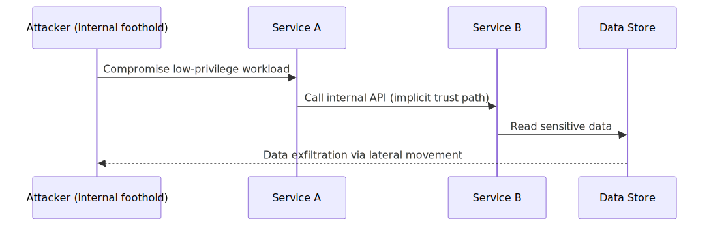
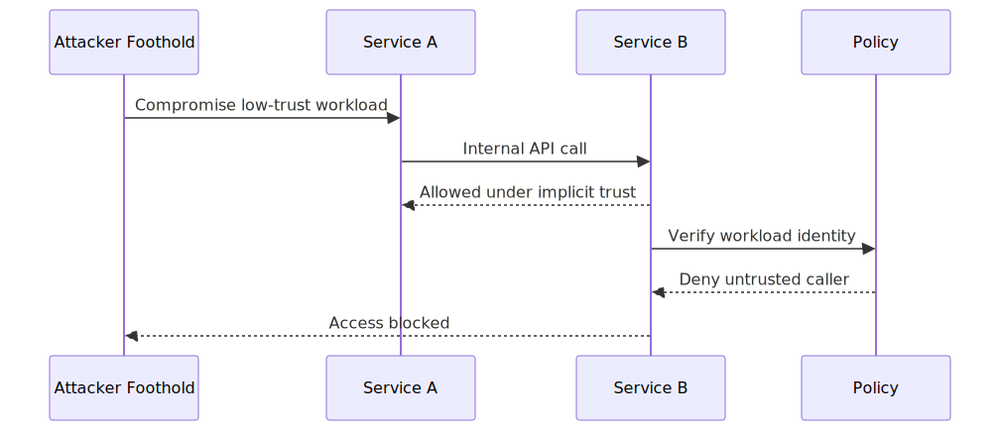

# Zero Trust Architecture Mistakes in Real Deployments

## Executive Summary

Many zero-trust programs look strong on slides and weak in runtime paths. User ingress is hardened, but east-west service behavior still depends on implicit trust, stale exceptions, or incomplete workload identity.

The gap is usually between policy intent and enforcement reality.

## System Context

Typical enterprise architecture:
- SSO and MFA at user ingress
- segmented networks with partial microsegmentation
- mixed legacy and cloud-native workloads
- service-to-service traffic with uneven identity enforcement

Zero trust invariant:
- every access decision should be continuously verified with strong identity, context, and policy

## Baseline Architecture

See `architecture.svg` (rendered) and `diagrams/architecture.mmd` (source).

## Normal Flow

1. User/workload authenticates.
2. Policy engine evaluates access context.
3. Access granted with least privilege.
4. Continuous signals can revoke/adjust trust.

## Failure Modes

1. Perimeter-only verification
- strong user login controls, weak internal service auth

2. Flat east-west trust
- workloads on same segment can communicate broadly by default

3. Static long-lived credentials
- no continuous verification or context-based re-evaluation

4. Policy bypass exceptions
- urgent allowlist exceptions become permanent hidden backdoors

## Attack/Abuse Flow

See `attack-flow.svg` (rendered) and `diagrams/attack-flow.mmd` (source).

See `sequence.svg` (rendered) and `diagrams/sequence.mmd` (source).

## Impact

- Confidentiality: lateral movement after initial foothold.
- Integrity: unauthorized internal operations.
- Availability: broad blast radius in ransomware-style propagation.
- Governance: compliance posture appears stronger than actual runtime enforcement.

## Detection Opportunities

- high-volume east-west connections outside baseline policy intent
- service calls lacking workload identity proofs
- stale privileged exceptions and unused allow rules
- mismatch between policy definition and observed enforcement

## Mitigation Strategy

See [mitigations.md](./mitigations.md).

## Why Existing Systems Fail

These gaps typically come from sequencing and operational friction:

- User auth controls roll out faster than workload identity controls.
- Exception paths created during incidents are not retired on schedule.
- East-west policy migration is harder than perimeter policy migration.
- Legacy systems resist mTLS and fine-grained authorization integration.

The outcome is uneven enforcement hidden behind strong top-level messaging.

## Real Incident Correlation

Common enterprise incident patterns fit this model:

- Lateral movement after initial foothold despite strong SSO/MFA.
- Internal service abuse through broad trust inside network zones.
- Long-lived exceptions expanding access beyond original intent.

What matters most is continuous runtime verification, not perimeter posture alone.

## Evidence

Signals to collect for validation:

- Metrics: `time-to-final-reject`, `policy-deny-rate`, and cross-replica decision divergence.
- Logs: identity context, enforcement path, and reason code for allow/deny decisions.
- Tests: replay, propagation-delay, and failover behavior under sustained load.

## Practical Demo

Companion demo:

- [zero-trust-mistakes-lab](../demo/zero-trust-mistakes-lab/README.md)
- [Run script](../demo/zero-trust-mistakes-lab/run-demo.sh)

## Known Limitations

- The demo does not represent full identity fabric or enterprise segmentation complexity.
- It simplifies policy engines and workload attestation mechanics.
- Real rollout quality depends on exception governance and continuous validation discipline.

## References

See [references.md](./references.md).
